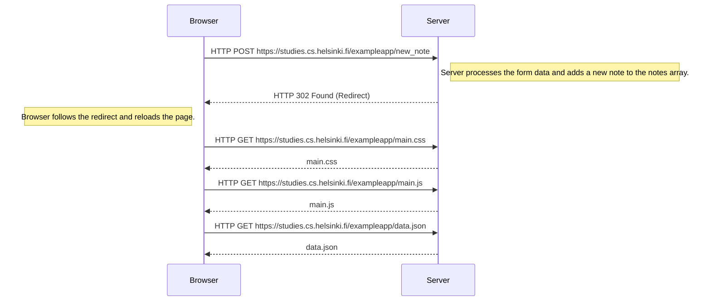

```mermaid
    sequenceDiagram
        participant Browser
        participant Server

        Browser->>Server: HTTP POST https://studies.cs.helsinki.fi/exampleapp/new_note
        Note right of Server: Server processes the form data and adds a new note to the notes array.
        Server-->>Browser: HTTP 302 Found (Redirect)
        Note left of Browser: Browser follows the redirect and reloads the page.

        Browser->>Server: HTTP GET https://studies.cs.helsinki.fi/exampleapp/main.css
        Server-->>Browser: main.css

        Browser->>Server: HTTP GET https://studies.cs.helsinki.fi/exampleapp/main.js
        Server-->>Browser: main.js

        Browser->>Server: HTTP GET https://studies.cs.helsinki.fi/exampleapp/data.json
        Server-->>Browser: data.json
```